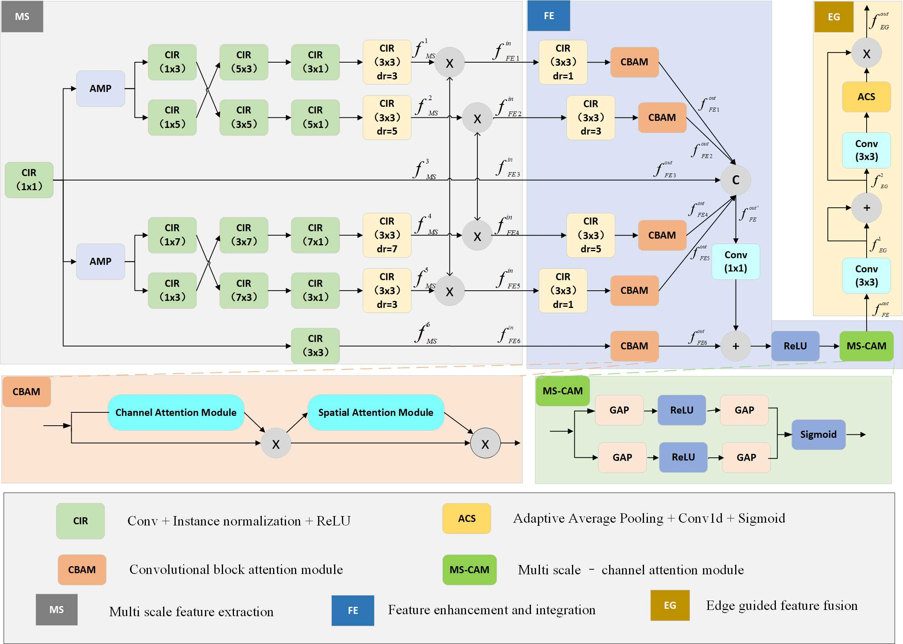
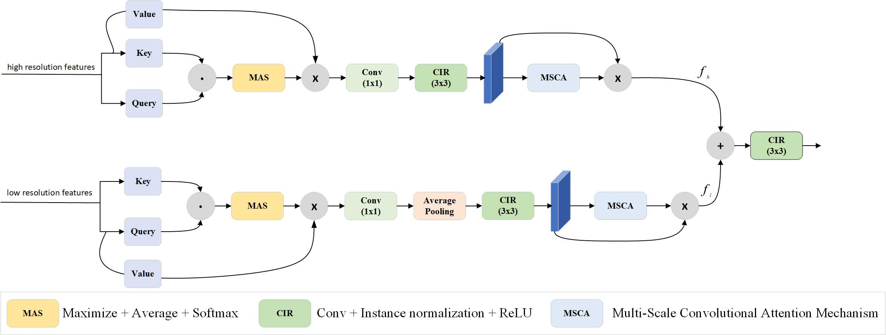

# HFINet: Hybrid Feature Integration for Enhancing Collaborative Camouflaged Object Detection

> **Authors:** 
> [Shiyuan Li](https://github.com/LSY20030127/), Hong-Bo Bi, Disen Mo, [Cong Zhang](https://github.com/zc199823/), Yue Li

## 1. Dataset

CoCOD8K can be download from [here](https://pan.quark.cn/s/5bdc87f4e0c0)[code:tdYx] or [Google Drive](https://drive.google.com/file/d/1wyLfm0QhpOsgM5NoNcGCbgXnzQzBAJiX/view?usp=sharing) .

## 2. Overview

      
    <em> 
    Figure 1: The overall architecture of the proposed model, which consists of three key components, 𝑖.𝑒. , Cross-Layer Feature Integration Module, Local Feature Refinement Module, and Dual Granularity Feature Fusion Module. See 3.2 for details on the Cross-Layer Feature Integration Module.
    </em>

## 3. Proposed Framework

### 3.1 Method

      
    <em> 
    Figure 2: The detailed information of our proposed LFR model.
    </em>

      
    <em> 
    Figure 3: The detailed information of our proposed DGFF model.
    </em>

### 3.2 Training/Testing

The training and testing experiments are conducted using PyTorch with  a NVIDIA GeForce RTX 3080 GPU.

1. Prerequisites:

Note that HFINet is only tested on Ubuntu OS with the following environments. It may work on other operating systems (i.e., Windows) as well but we do not guarantee that it will.

 + Creating a virtual environment in terminal: `conda create -n HFINet python=3.6`.
 + Installing necessary packages: [PyTorch > 1.1](https://pytorch.org/), [opencv-python](https://pypi.org/project/opencv-python/)

2. Prepare the data:
   + downloading testing dataset and moving it into `./Dataset/TestDataset/`.
    + downloading training/validation dataset and move it into `./Dataset/TrainDataset/`.
    + downloading pre-trained weights and move it into `./pth/HFINet.59`, 
      which can be found in [here](https://pan.quark.cn/s/c435629da124).
    + downloading pvt_v2_b2 weights and move it into `./pth/backbone/pvt_v2_b2.59` [download link](https://pan.quark.cn/s/51993452f527).

3. Training Configuration:

   + Assigning your costumed path, like `--train_save` and `--train_path` in `train.py`.

   + Just enjoy it via run `python train.py` in your terminal.

4. Testing Configuration:

   + After you download all the pre-trained models and testing datasets, just run `test.py` to generate the final prediction map: 
     replace your trained model directory (`--pth`).

   + Just enjoy it!

### 3.3 Evaluating your trained model:

You can evaluate the result maps using the tool from [here](https://pan.quark.cn/s/67b5cb4ace08).

